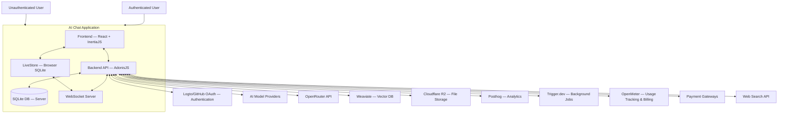

# kamba

> This project is my implementation of the [T3 Chat Cloneathon](https://cloneathon.t3.chat/)

A premium AI chat application, offering multiple language model support, BYOK functionality, and advanced features like RAG, file uploads, and local-first chat history with server sync.

## Overview

This application provides a feature-rich AI chat experience with the flexibility to choose models and use your own API keys. The service is designed with a premium model, offering easy trial access while maintaining a paywall for full features. The architecture follows a service-oriented approach to enable future scaling and feature development. Chat history is managed locally using LiveStore in the browser for a fast, responsive feel, with server-side backup and synchronization handled via WebSockets.

## Features

### Core Features

- Multiple language models and providers with BYOK functionality
- Browser-friendly interface
- User authentication with local-first chat history synchronized with the server
- Easy to try with premium features behind a paywall
- Bring your own key with priority support for OpenRouter API keys
- Custom prompts for everyday tasks

### Bonus Features

- File uploads (images and PDFs)
- Syntax highlighting for code formatting
- Chat branching to create alternative conversation paths
- Real-time web search
- AI-powered image generation
- Resumable streams (continue generation after page refresh, integrated with local-first storage)
- Chat sharing
- Local-first storage using LiveStore

## Project Status

For a detailed development roadmap and the current status of all features, please see the [GitHub Project](https://github.com/users/stctheproducer/projects/1).

## Technology Stack

- **Backend**: AdonisJS v6
- **Frontend**: InertiaJS v2, React 19, Shadcn UI, Assistant-UI
- **Database**: SQLite (main data, cache, limiter), Weaviate (vector DB)
- **Local-First Storage & Sync**: LiveStore, `adonisjs-websocket`
- **Authentication**:
  - **Logto**: A complete authentication solution with enterprise-grade security features
  - **GitHub OAuth**: Quick and easy sign-in using your GitHub account

  You can choose either authentication method during the sign-up process. Both options provide secure access to all of kamba's features.
- **Storage**: Cloudflare R2
- **Caching**: SQLite (via `@adonisjs/cache`)
- **Rate Limiting**: SQLite (via `@adonisjs/limiter`)
- **Background Jobs**: Trigger.dev (optional for chat generation)
- **Analytics & Monitoring**: Posthog, OpenMeter
- **Payment Processing**: Lipila & Lenco (local), Paddle & Stripe (international via `@foadonis/shopkeeper`)
- **AI SDKs**: `ai` (from vercel), `@ai-sdk`

## Architecture Overview

This system follows a local-first architecture with server sync, centered around the AI Chat Application. The following diagram illustrates the main components and their interactions:



### Key Components

- **Users**: Both authenticated (paid/trial) and unauthenticated users interact with the system.

- **Frontend**: Browser-based interface built with React and InertiaJS that provides the user experience.

- **LiveStore**: Browser-based SQLite instance that stores chat history locally for fast, offline-capable access.

- **Backend API**: AdonisJS application that handles business logic, authentication, external service integration, and data management.

- **WebSocket Server**: Manages real-time synchronization between the browser's LiveStore and the server's SQLite database.

- **SQLite Database**: Server-side storage for user data, chat backups, and application state.

- **External Services**:
  - **Authentication Providers**:
  - **Logto**: Handles user authentication and identity management
  - **GitHub OAuth**: Provides social authentication via GitHub
  - **AI Model Providers**: Services like OpenAI, Anthropic, etc. that provide the AI models
  - **OpenRouter API**: Aggregates multiple AI models with BYOK support
  - **Weaviate**: Vector database for RAG (Retrieval-Augmented Generation)
  - **Cloudflare R2**: Object storage for uploaded files
  - **Posthog**: Analytics and error tracking
  - **Trigger.dev**: Background job processing
  - **OpenMeter**: Usage tracking for billing and limits
  - **Payment Gateways**: Handle subscription and one-time payments
  - **Web Search API**: Provides real-time information for chat context

## Installation & Setup

### Prerequisites

- Node.js 22+
- SQLite 3.36.0+
- Weaviate instance (for RAG features)
- Cloudflare R2 account (for file storage)

### Environment Setup

1. Clone the repository

```bash
git clone https://github.com/stctheproducer/kamba.git
git switch main # The default branch is develop
cd kamba
```

2. Install dependencies using pnpm

```bash
pnpm install
```

3. Configure environment variables

```bash
cp .env.example .env
```

Edit the `.env` file with your configuration details, including paths for the SQLite files and external service credentials.

4. Generate the projects `APP_KEY` secret using the following command

```bash
node ace key:generate
```

5. Run database migrations (for server-side SQLite)

```bash
node ace migration:run
```

### Environment Variables with dotenvx

This project uses [dotenvx](https://dotenvx.com) for secure environment variable management. Here's how to use it:

1. Install dotenvx CLI (if not already installed):

```bash
curl -fsSL https://dotenvx.com/install.sh | bash
```

2. Set up your environment files:

```bash
# Development
cp .env.example .env

# Testing
cp .env.example .env.test

# Production
cp .env.example .env.production
```

3. Use dotenvx commands to manage your environment:

```bash
# Set variables
pnpm env:prod:set KEY=value
pnpm env:test:set KEY=value

# Get variables
pnpm env:prod:get KEY
pnpm env:test:get KEY
```

4. Run commands with dotenvx:

```bash
# Development
pnpm dev  # Uses dotenvx under the hood

# Production
pnpm start  # Uses dotenvx with production env
```

!!! note
    Using dotenvx is optional but recommended for secure environment variable management. You may opt to use other methods if preferred.

### Docker Support

You can run the application using Docker:

1. Build the Docker image:

```bash
pnpm docker:build
```

2. Run the container:

```bash
pnpm docker:run
```

The Docker setup includes:

- Volume mount for SQLite database files in `/app/tmp`
- Built-in dotenvx support
- Proper Node.js environment with pnpm
- Production-ready configuration

Note: When using Docker, make sure to:

- Mount your environment files appropriately
- Use the tmp volume for persistent database storage
- Configure your environment variables through dotenvx

### Development Scripts

Here are some useful scripts from `package.json`:

- `pnpm dev`: Start the development server with hot-reloading.
- `pnpm build`: Build the application for production.
- `pnpm start`: Start the production server.
- `pnpm typecheck`: Check TypeScript types.
- `pnpm lint`: Run ESLint for code linting.
- `pnpm format`: Run Prettier to format code.
- `pnpm test`: Run application tests.

## Architecture

The application follows a service-oriented architecture.

- **Frontend**: Built with React and InertiaJS, using Shadcn UI and Assistant-UI for components. It incorporates **LiveStore** to manage chat history and related user data locally in a browser-based SQLite instance, providing a fast "local-first" experience.
- **Backend API**: An AdonisJS v6 application handling core logic, API endpoints, authentication integration (Logto), interactions with external services (AI providers, Cloudflare R2, Posthog, OpenMeter, Payment Gateways), and managing server-side data in **SQLite** files. It also hosts the **custom LiveStore sync provider** over **WebSockets** (`adonisjs-websocket`) to synchronize chat data with client LiveStore instances.
- **Databases**:
  - **SQLite Files**: Stored on the server's file system for main application data (user info, BYOK keys, payments, logs), caching, and rate limiting state.
  - **Weaviate**: A dedicated vector database for storing and querying embeddings used in the RAG feature.
- **External Services**: Integration with third-party platforms for authentication (Logto), AI models, object storage (Cloudflare R2), analytics (Posthog), background jobs (Trigger.dev - optional for certain chat generation tasks), usage tracking (OpenMeter), and payment processing.

Data flow for chat history is primarily between the Frontend (LiveStore) and the Backend API (SQLite backup) via the WebSocket sync. Other data is managed directly by the Backend API in the server-side SQLite files or external services.

## Realtime Implementation

Realtime features are handled using **WebSockets** via `adonisjs-websocket` and centered around **LiveStore**'s synchronization:

- **WebSocket Server**: Hosted in the AdonisJS backend, handling authenticated client connections.
- **LiveStore Sync Provider**: A custom implementation in the backend that synchronizes mutations between the client's LiveStore instance (in the browser) and the server's main SQLite database. It listens for client changes via WebSocket and pushes server-side changes (from other devices, background tasks, AI streaming) to connected clients.
- **AI Response Streaming**: AI model responses are streamed chunk by chunk from the backend. These chunks are sent over the WebSocket sync to the client's LiveStore, which appends them to the local message record in real-time.
- **Resumable Streams**: Since LiveStore manages the full message content locally as it streams, resuming a generation after a disconnection involves the client reconnecting the WebSocket. LiveStore's sync protocol, combined with the backend's knowledge of the message state (from the server-side SQLite backup), allows the sync provider to potentially resume sending any missing chunks or let LiveStore reconcile the state.

## Author

- **Name**: Chanda Mulenga
- **Email**: <chanda@kamba.app>
- **GitHub**: [stctheproducer](https://github.com/stctheproducer)

## License

This project is licensed under the Apache License 2.0 - see the [LICENSE](LICENSE) file for details.

## Security

For information about security policies and reporting vulnerabilities, please see the [SECURITY.md](SECURITY.md) file.

## Contributing

Contributions to kamba are welcome and appreciated! Whether you're fixing bugs, adding features, improving documentation, or spreading the word, your help makes this project better.

### How to Contribute

Please read our [CONTRIBUTING.md](CONTRIBUTING.md) file for detailed guidelines on how to contribute to this project. Here's a quick overview:

1. **Fork the repository** and clone it locally
2. **Create a branch** for your contribution
3. **Make your changes**, following our code style and commit message conventions
4. **Write or update tests** as needed
5. **Submit a pull request** with a clear description of the changes and any relevant issue numbers

We use GitHub templates for issues and pull requests to maintain consistency and provide necessary information. When creating a new issue or PR, please use the provided templates.

### Development Workflow

Our development workflow follows these principles:

1. **Feature branches**: Create separate branches for each feature or bug fix
2. **Conventional commits**: Follow the [Conventional Commits](https://www.conventionalcommits.org/) specification
3. **Test-driven development**: Write tests before implementing features when possible
4. **Code reviews**: All PRs require review before merging
5. **CI/CD**: Automated testing and linting run on all PRs

Before submitting your contribution, please ensure your code:

- Passes all tests (`pnpm test`)
- Has proper type definitions (`pnpm typecheck`)
- Follows our linting rules (`pnpm lint`)
- Is properly formatted (`pnpm format`)

## Community

Join our community to get help, share ideas, or contribute to kamba's development!

### Support Channels

- **GitHub Discussions**: Use the [Discussions](https://github.com/stctheproducer/kamba/discussions) tab for questions, ideas, and community interactions
- **Discord Server**: Join our [Discord community](https://discord.gg/VSMwYCk58V) for real-time discussions
- **Twitter**: Follow [@stctheproducer](https://twitter.com/stctheproducer) for announcements

### Getting Help

If you need help with using kamba or implementing a feature:

1. Check the [documentation](https://github.com/stctheproducer/kamba/wiki) (coming soon)
2. Search for similar questions in [GitHub Discussions](https://github.com/stctheproducer/kamba/discussions)
3. Create a new discussion if you can't find an answer

### Reporting Bugs

If you find a bug, please report it by creating an issue using our bug report template. Be sure to include:

- A clear description of the issue
- Steps to reproduce
- Expected vs. actual behavior
- Any relevant logs or screenshots

For security vulnerabilities, please follow the instructions in our [SECURITY.md](SECURITY.md) file.
