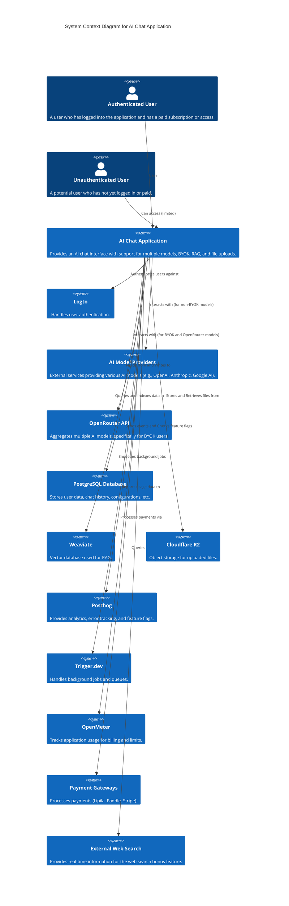

# Design Document

Version: 1.0
Date: 2025-06-12

## BUSINESS POSTURE

The primary business goal of this application is to provide a premium, feature-rich AI chat experience that allows users flexibility in choosing models and the option to use their own API keys. The paywall ensures a revenue model, while the "easy to try" aspect aims to lower the barrier to entry for potential paying users. Supporting BYOK, especially for OpenRouter, caters to users who may have existing API access or prefer centralized billing outside the application for usage costs, while the application provides a superior interface and additional features like RAG, file uploads, and chat management. The service-oriented architecture goal is to enable future scaling and feature development by potentially breaking down components into microservices.

### Most important business risks

* **Monetization Risk:** The success depends heavily on the paywall and premium features being compelling enough for users to pay, especially when many free or lower-cost alternatives exist.
* **User Adoption Risk:** Attracting users in a crowded market, despite the unique features like BYOK and the specific UI/UX theme.
* **API Key Security Risk:** Storing and managing user-provided API keys requires robust security measures to prevent breaches, which could severely damage trust and reputation.
* **Scalability Risk:** As the user base grows, ensuring the application can handle increased load on the backend, databases, AI model interactions, and realtime features is crucial.
* **Feature Development Risk:** Successfully integrating numerous third-party libraries and services (payment gateways, RAG, analytics, authentication, multiple AI APIs) requires significant development effort and introduces potential integration challenges.

## SECURITY POSTURE

### Existing security controls

* security control: User authentication provided by Logto.
* security control: Activity logging via adonisjs-activitylog.
* security control: Auditing via adonis-auditing package.
* security control: Encryption utilities provided by @adonisjs/encryption (likely used for sensitive data like API keys).
* security control: Locking mechanism provided by @adonisjs/lock (potentially for resource access control or rate limiting).
* security control: Logging infrastructure via @adonisjs/logger.

### Accepted risks

* No specific accepted risks were mentioned in the input. It is assumed that all identified risks should be mitigated or addressed.

### Recommended security controls

* security control: Input validation on all user-provided data (chat messages, file uploads, configuration settings, API keys) to prevent injection attacks (XSS, SQL injection, etc.).
* security control: Rate limiting on API endpoints (chat requests, authentication attempts, file uploads) to prevent abuse and denial-of-service attacks.
* security control: Secure storage and strict access control for user-provided API keys, potentially using a dedicated secret management system or robust encryption with limited access within the application.
* security control: Implement granular authorization checks to ensure users can only access their own chats, files, and settings.
* security control: Regular security audits and penetration testing of the application and infrastructure.
* security control: Enforce secure coding practices throughout the development lifecycle.
* security control: Implement Content Security Policy (CSP) headers to mitigate XSS attacks in the frontend.
* security control: Secure configuration management for all services and databases.

### Security requirements

* Security requirement: All user data, including chat history and uploaded files, must be stored securely and be accessible only by the authenticated user.
* Security requirement: User-provided API keys must be encrypted at rest and in transit. Access to these keys must be strictly controlled.
* Security requirement: The application must authenticate all users before allowing access to paid features and personalized data (chat history, settings).
* Security requirement: Communication between the frontend and backend, and between the backend and external services (AI providers, Logto, payment gateways), must be encrypted (e.g., using TLS/SSL).
* Security requirement: The application must be resilient to common web vulnerabilities such as injection attacks, cross-site scripting (XSS), and cross-site request forgery (CSRF).
* Security requirement: Compliance with relevant data privacy regulations (e.g., GDPR, CCPA) depending on user location and data handled.

## DESIGN

### C4 CONTEXT

The system context diagram shows the AI Chat Application system in the middle, surrounded by the users who interact with it and the external systems it depends on.



| Name                  | Type            | Description                                                                 | Responsibilities                                                                 | Security controls                                                                 |
| :-------------------- | :-------------- | :-------------------------------------------------------------------------- | :------------------------------------------------------------------------------- | :-------------------------------------------------------------------------------- |
| Authenticated User    | Person          | A user who is logged in and has access to paid features.                    | Interact with the AI, manage settings, view history, manage BYOK keys.           | N/A (User is external)                                                            |
| Unauthenticated User  | Person          | A visitor who has not logged in.                                            | View landing page, potentially limited chat access (easy to try), sign up/login. | N/A (User is external)                                                            |
| AI Chat Application   | Software System | The main application providing the chat interface and backend logic.        | Manage user sessions, handle chat interactions, orchestrate AI calls, manage data. | Logto for authentication, adonis-auditing, adonisjs-activitylog, @adonijs/encryption, @adonijs/lock, @adonisjs/logger, Input Validation, Rate Limiting, Authorization Checks, Secure Configuration. |
| Logto               | Software System | Third-party authentication service.                                         | User registration, login, identity management, providing user tokens.          | N/A (External System - Security managed by Logto)                                 |
| AI Model Providers    | Software System | External services hosting various language models.                          | Process prompts, generate responses.                                             | N/A (External System - Security managed by providers)                             |
| OpenRouter API        | Software System | Aggregates access to multiple AI models, including BYOK support.            | Route AI requests, manage API keys (for their own service), process prompts.     | N/A (External System - Security managed by OpenRouter)                            |
| PostgreSQL Database   | Database        | Relational database storing structured application data.                    | Store user data, chat history, configurations, payment records, activity logs.   | Access control, Encryption at rest (if configured), Regular backups.              |
| Weaviate              | Database        | Vector database for storing and querying embeddings for RAG.              | Store document embeddings, perform similarity searches for RAG context.          | Access control, Network isolation.                                                |
| Cloudflare R2         | Storage         | Object storage service for storing uploaded files.                          | Store and serve user-uploaded files securely.                                    | Access control policies, Encryption in transit and at rest.                       |
| Posthog               | Software System | Analytics, error tracking, and feature flagging platform.                   | Collect user behavior data, track errors, manage feature flag rollout.           | N/A (External System - Security managed by Posthog)                               |
| Trigger.dev           | Software System | Background job processing and queue management.                             | Execute tasks like file processing, image generation, notifications asynchronously. | N/A (External System - Security managed by Trigger.dev)                           |
| OpenMeter             | Software System | Usage tracking and metering platform.                                       | Record and aggregate user usage data (e.g., tokens used, files uploaded).        | N/A (External System - Security managed by OpenMeter)                             |
| Payment Gateways      | Software System | External services for processing online payments.                           | Handle payment transactions (credit cards, mobile money, etc.).                  | N/A (External System - Security managed by gateways, PCI compliance)              |
| External Web Search | Software System | Provides real-time data for the web search feature.                         | Fetch and return search results based on queries.                                | N/A (External System - Security managed by provider)                              |

### DATABASE DESIGN (PostgreSQL)

The database design centers around users, their chats, messages, and associated data like uploaded files, BYOK keys, and payment information.

```mermaid
erDiagram
    users {
        uuid id PK
        uuid logto_id UK "Link to Logto user"
        varchar email UK
        varchar username
        timestamp created_at
        timestamp updated_at
        boolean is_beta_user
        boolean is_paying_user
    }

    chats {
        uuid id PK
        uuid user_id FK
        varchar title
        timestamp created_at
        timestamp updated_at
    }

    messages {
        uuid id PK
        uuid chat_id FK
        uuid? parent_message_id FK "For branching"
        varchar role "system, user, assistant, tool"
        text content
        jsonb metadata "e.g., tool calls, source documents"
        timestamp created_at
        timestamp updated_at
    }

    files {
        uuid id PK
        uuid user_id FK
        uuid? message_id FK "Optional: link to message that included the file"
        varchar file_name
        varchar file_type
        integer file_size
        varchar storage_path "Path in Cloudflare R2"
        varchar status "e.g., uploaded, processing, processed, failed"
        jsonb processing_details "e.g., RAG indexing status"
        timestamp created_at
        timestamp updated_at
    }

    models {
        uuid id PK
        varchar provider_name
        varchar model_id UK "Unique identifier for the model"
        varchar name "Human-readable name"
        boolean is_available
        boolean is_byok_supported
        boolean is_paid_model
        jsonb capabilities "e.g., image_generation, web_search"
        timestamp created_at
        timestamp updated_at
    }

    user_models {
        uuid id PK
        uuid user_id FK
        uuid model_id FK "Reference to the models table"
        text api_key "Encrypted API key"
        boolean is_active
        jsonb settings "e.g., specific model parameters"
        timestamp created_at
        timestamp updated_at
    }

    payments {
        uuid id PK
        uuid user_id FK
        varchar gateway "Stripe, Paddle, Lipila"
        varchar transaction_id UK
        numeric amount
        varchar currency
        varchar status "e.g., pending, completed, failed"
        jsonb details "Gateway-specific details"
        timestamp created_at
        timestamp updated_at
    }

    subscriptions {
        uuid id PK
        uuid user_id FK
        varchar plan_name
        varchar status "e.g., active, cancelled, past_due"
        timestamp start_date
        timestamp end_date
        varchar gateway_subscription_id "Reference to the gateway"
        jsonb details
        timestamp created_at
        timestamp updated_at
    }

    activity_logs {
        uuid id PK
        uuid user_id FK
        varchar event_name
        jsonb details
        timestamp created_at
    }

    audit_logs {
        uuid id PK
        uuid user_id FK
        varchar action
        varchar model_name
        uuid model_id
        jsonb old_data
        jsonb new_data
        timestamp created_at
    }

    users ||--|{ chats : "creates"
    chats ||--|{ messages : "contains"
    messages }o--o{ messages : "branches from"
    users ||--|{ files : "uploads"
    files }o--|| messages : "part of"
    users ||--|{ user_models : "configures"
    models ||--|{ user_models : "is configured for"
    users ||--|{ payments : "makes"
    users ||--|{ subscriptions : "has"
    users ||--|{ activity_logs : "generates"
    users ||--|{ audit_logs : "generates"
```

#### users Table

| Column        | Type      | Description                         | Constraints            |
| :------------ | :-------- | :---------------------------------- | :--------------------- |
| id            | UUID      | Primary key                         | PK                     |
| logto_id      | UUID      | Unique ID from Logto              | UK, Not Null           |
| email         | VARCHAR   | User's email address                | UK, Not Null           |
| username      | VARCHAR   | User's chosen username              | Optional               |
| created_at    | TIMESTAMP | Record creation timestamp           | Not Null               |
| updated_at    | TIMESTAMP | Record last update timestamp        | Not Null               |
| is_beta_user  | BOOLEAN   | Flag for beta program participants  | Not Null, Default False |
| is_paying_user| BOOLEAN   | Flag indicating active subscription | Not Null, Default False |

#### chats Table

| Column    | Type      | Description                 | Constraints   |
| :-------- | :-------- | :-------------------------- | :------------ |
| id        | UUID      | Primary key                 | PK            |
| user_id   | UUID      | Foreign key referencing users | FK, Not Null  |
| title     | VARCHAR   | Title of the chat session   | Optional      |
| created_at| TIMESTAMP | Record creation timestamp   | Not Null      |
| updated_at| TIMESTAMP | Record last update timestamp| Not Null      |

#### messages Table

| Column           | Type      | Description                                   | Constraints            |
| :--------------- | :-------- | :-------------------------------------------- | :--------------------- |
| id               | UUID      | Primary key                                   | PK                     |
| chat_id          | UUID      | Foreign key referencing chats                 | FK, Not Null           |
| parent_message_id| UUID      | Foreign key for branching (self-referencing)  | FK, Optional           |
| role             | VARCHAR   | Role of the message sender (system, user, etc)| Not Null               |
| content          | TEXT      | The actual message content                    | Not Null               |
| jsonb            | JSONB     | Metadata (e.g., tool calls, RAG sources)      | Optional               |
| created_at       | TIMESTAMP | Record creation timestamp                     | Not Null               |
| updated_at       | TIMESTAMP | Record last update timestamp                  | Not Null               |

#### files Table

| Column             | Type      | Description                             | Constraints         |
| :----------------- | :-------- | :-------------------------------------- | :------------------ |
| id                 | UUID      | Primary key                             | PK                  |
| user_id            | UUID      | Foreign key referencing users           | FK, Not Null        |
| message_id         | UUID      | Foreign key referencing messages        | FK, Optional        |
| file_name          | VARCHAR   | Original name of the uploaded file      | Not Null            |
| file_type          | VARCHAR   | MIME type of the file                   | Not Null            |
| file_size          | INTEGER   | Size of the file in bytes               | Not Null            |
| storage_path       | VARCHAR   | Path or key in Cloudflare R2            | Not Null            |
| status             | VARCHAR   | Current processing status (e.g., 'processed')| Not Null            |
| processing_details | JSONB     | Details about RAG indexing or processing| Optional            |
| created_at         | TIMESTAMP | Record creation timestamp               | Not Null            |
| updated_at         | TIMESTAMP | Record last update timestamp            | Not Null            |

#### models Table

| Column            | Type      | Description                                   | Constraints         |
| :---------------- | :-------- | :-------------------------------------------- | :------------------ |
| id                | UUID      | Primary key                                   | PK                  |
| provider_name     | VARCHAR   | Name of the AI model provider                 | Not Null            |
| model_id          | VARCHAR   | Unique identifier from the provider/OpenRouter| UK, Not Null        |
| name              | VARCHAR   | Human-readable name of the model              | Not Null            |
| is_available      | BOOLEAN   | Is the model currently available for use?     | Not Null            |
| is_byok_supported | BOOLEAN   | Does this model support Bring Your Own Key?   | Not Null            |
| is_paid_model     | BOOLEAN   | Does using this model require a paid plan?    | Not Null            |
| capabilities      | JSONB     | JSON object listing model capabilities        | Optional            |
| created_at        | TIMESTAMP | Record creation timestamp                     | Not Null            |
| updated_at        | TIMESTAMP | Record last update timestamp                  | Not Null            |

#### user_models Table

| Column      | Type      | Description                                   | Constraints           |
| :---------- | :-------- | :-------------------------------------------- | :-------------------- |
| id          | UUID      | Primary key                                   | PK                    |
| user_id     | UUID      | Foreign key referencing users                 | FK, Not Null          |
| model_id    | UUID      | Foreign key referencing models                | FK, Not Null          |
| api_key     | TEXT      | Encrypted API key for the specific model/user | Not Null (must be encrypted) |
| is_active   | BOOLEAN   | Is this BYOK configuration currently active?  | Not Null, Default True |
| settings    | JSONB     | User-specific settings for this model         | Optional              |
| created_at  | TIMESTAMP | Record creation timestamp                     | Not Null              |
| updated_at  | TIMESTAMP | Record last update timestamp                  | Not Null              |

Note: The `api_key` field must be encrypted using `@adonijs/encryption` before storing and decrypted only when needed for API calls. Access to the decryption key should be highly restricted.

#### payments Table

| Column             | Type      | Description                           | Constraints         |
| :----------------- | :-------- | :------------------------------------ | :------------------ |
| id                 | UUID      | Primary key                           | PK                  |
| user_id            | UUID      | Foreign key referencing users         | FK, Not Null        |
| gateway            | VARCHAR   | Payment gateway used (Stripe, Paddle, etc)| Not Null            |
| transaction_id     | VARCHAR   | Unique ID from the payment gateway    | UK, Not Null        |
| amount             | NUMERIC   | Amount paid                           | Not Null            |
| currency           | VARCHAR   | Currency code (e.g., 'ZMW', 'USD')    | Not Null            |
| status             | VARCHAR   | Status of the payment                 | Not Null            |
| details            | JSONB     | Gateway-specific transaction details  | Optional            |
| created_at         | TIMESTAMP | Record creation timestamp             | Not Null            |
| updated_at         | TIMESTAMP | Record last update timestamp          | Not Null            |

#### subscriptions Table

| Column              | Type      | Description                                   | Constraints    |
| :------------------ | :-------- | :-------------------------------------------- | :------------- |
| id                  | UUID      | Primary key                                   | PK             |
| user_id             | UUID      | Foreign key referencing users                 | FK, Not Null   |
| plan_name           | VARCHAR   | Name of the subscription plan                 | Not Null       |
| status              | VARCHAR   | Status of the subscription                    | Not Null       |
| start_date          | TIMESTAMP | When the subscription started                 | Not Null       |
| end_date            | TIMESTAMP | When the subscription ends                    | Not Null       |
| gateway_subscription_id| VARCHAR| Reference ID in the payment gateway         | UK, Not Null   |
| details             | JSONB     | Gateway-specific subscription details         | Optional       |
| created_at          | TIMESTAMP | Record creation timestamp                     | Not Null       |
| updated_at          | TIMESTAMP | Record last update timestamp                  | Not Null       |

#### activity_logs Table

| Column    | Type      | Description                         | Constraints  |
| :-------- | :-------- | :---------------------------------- | :----------- |
| id        | UUID      | Primary key                         | PK           |
| user_id   | UUID      | Foreign key referencing users       | FK, Optional |
| event_name| VARCHAR   | Name of the activity (e.g., 'user.login')| Not Null     |
| details   | JSONB     | Details of the activity             | Optional     |
| created_at| TIMESTAMP | Record creation timestamp           | Not Null     |

Note: `user_id` is optional to log system activities not tied to a specific user.

#### audit_logs Table

| Column    | Type      | Description                               | Constraints  |
| :-------- | :-------- | :---------------------------------------- | :----------- |
| id        | UUID      | Primary key                               | PK           |
| user_id   | UUID      | Foreign key referencing users             | FK, Optional |
| action    | VARCHAR   | Type of action (e.g., 'create', 'update', 'delete')| Not Null     |
| model_name| VARCHAR   | Name of the model affected (e.g., 'User')| Not Null     |
| model_id  | UUID      | ID of the affected record                 | Optional     |
| old_data  | JSONB     | Previous state of the record            | Optional     |
| new_data  | JSONB     | New state of the record                 | Optional     |
| created_at| TIMESTAMP | Record creation timestamp                 | Not Null     |

Note: This table is primarily managed by the `adonis-auditing` package.

### C4 CONTAINER

The container diagram shows the main deployable units of the system and how they interact.

```mermaid
C4Container
title Container Diagram for AI Chat Application

System_Boundary(ai_chat_system_boundary, "AI Chat Application")
    Container(frontend, "Frontend", "React, InertiaJS, Shadcn, Assistant-UI", "Provides the user interface.")
    Container(backend_api, "Backend API", "AdonisJS v6", "Provides the application logic and API endpoints.")
    Container(redis_cache, "Redis Cache", "Redis", "Stores cached data and handles job queues (secondary to Trigger.dev).") # Used by @adonisjs/redis, @adonisjs/cache, potentially @adonisjs/lock
    Container(postgresql_container, "PostgreSQL Database", "PostgreSQL", "Stores application data.") # Used by @adonisjs/lucid
    Container(weaviate_container, "Weaviate Database", "Weaviate", "Stores vector embeddings for RAG.")
    Container(pglite_container, "PGLite Instance", "PGLite", "Local-first database storage in the browser.")
System_Boundary(ai_chat_system_boundary)

System(logto_auth, "Logto", "Authentication Service")
System(ai_model_providers, "AI Model Providers", "External AI Model Services")
System(openrouter_api, "OpenRouter API", "Aggregated AI Model Service")
System(cloudflare_r2, "Cloudflare R2", "Object Storage")
System(posthog_analytics, "Posthog", "Analytics, Error Tracking, Feature Flags")
System(trigger_dev, "Trigger.dev", "Background Jobs and Queues")
System(openmeter_usage, "OpenMeter", "Usage Tracking")
System(payment_gateways, "Payment Gateways", "Payment Processing Services")
System(external_web_search, "External Web Search", "Web Search API")

Rel(authenticated_user, frontend, "Uses", "HTTPS")
Rel(unauthenticated_user, frontend, "Uses", "HTTPS")

Rel(frontend, backend_api, "Requests data from and Sends commands to", "HTTPS, WebSockets (for realtime)")
Rel(frontend, pglite_container, "Reads from and Writes to (local-first)", "IndexedDB/File System API")

Rel(backend_api, postgresql_container, "Reads from and Writes to", "Database Protocol")
Rel(backend_api, redis_cache, "Reads from and Writes to", "Redis Protocol")
Rel(backend_api, weaviate_container, "Queries and Writes data to", "HTTP/HTTPS")
Rel(backend_api, cloudflare_r2, "Uploads and Retrieves files from", "HTTPS")
Rel(backend_api, logto_auth, "Authenticates users against", "HTTPS")
Rel(backend_api, ai_model_providers, "Makes AI requests to", "HTTPS")
Rel(backend_api, openrouter_api, "Makes AI requests to (including BYOK)", "HTTPS")
Rel(backend_api, posthog_analytics, "Sends events and Checks flags with", "HTTPS")
Rel(backend_api, trigger_dev, "Enqueues jobs in", "HTTPS")
Rel(backend_api, openmeter_usage, "Reports usage data to", "HTTPS")
Rel(backend_api, payment_gateways, "Initiates and Confirms payments with", "HTTPS")
Rel(backend_api, external_web_search, "Queries for real-time info", "HTTPS")

Rel(trigger_dev, backend_api, "Can call back into the API (e.g., update processing status)", "HTTPS")
Rel(trigger_dev, weaviate_container, "Indexes data in (for RAG processing)", "HTTP/HTTPS")
Rel(trigger_dev, ai_model_providers, "Makes AI requests (e.g., image generation)", "HTTPS") # For background AI tasks
```

| Name                 | Type         | Description                                                                   | Responsibilities                                                                 | Security controls                                                                 |
| :------------------- | :----------- | :---------------------------------------------------------------------------- | :------------------------------------------------------------------------------- | :-------------------------------------------------------------------------------- |
| Frontend             | Container    | User interface layer built with React and InertiaJS.                        | Render UI, capture user input, display chat messages, manage local state (PGLite). | Input validation, HTTPS, CSP, Client-side authentication token management.          |
| Backend API          | Container    | Application logic layer built with AdonisJS.                                | Handle user requests, interact with databases and external services, orchestrate AI calls, manage sessions, enforce business rules, handle payments. | Logto integration, Authentication & Authorization checks, Input validation, Rate limiting, Encryption of sensitive data, Secure configuration. |
| Redis Cache          | Container    | In-memory data store for caching and transient data.                          | Cache database queries, store session data, manage rate limits, potentially handle realtime event buffering. | Network isolation, Access control (authentication if possible).                   |
| PostgreSQL Database  | Container    | Relational database for persistent application data.                          | Store users, chats, messages, files metadata, payments, subscriptions, logs.     | Network isolation, Access control, Encryption at rest (if configured).            |
| Weaviate Database    | Container    | Vector database for RAG functionality.                                        | Store document embeddings, perform vector similarity search.                     | Network isolation, Access control.                                                |
| PGLite Instance      | Container    | Browser-based PostgreSQL instance for local-first storage.                    | Store a subset of user data (chats, messages) locally for offline access.        | Stored within the browser sandbox, relies on browser security and user login.     |
| Logto                | Software System| External authentication provider.                                             | User registration, login, identity verification.                                 | N/A (External System)                                                             |
| AI Model Providers   | Software System| External APIs providing various AI models.                                    | Generate AI responses.                                                           | N/A (External System)                                                             |
| OpenRouter API       | Software System| Aggregates AI models, supports BYOK.                                          | Route AI requests to underlying providers.                                       | N/A (External System)                                                             |
| Cloudflare R
| Posthog              | Software System| Analytics, error tracking, feature flags.                                     | Data collection and analysis.                                                    | N/A (External System)                                                             |
| Trigger.dev          | Software System| Background job and queue management.                                          | Process files, handle image generation, send notifications asynchronously.         | N/A (External System)                                                             |
| OpenMeter            | Software System| Usage metering platform.                                                      | Track user consumption of resources (AI tokens, file storage).                   | N/A (External System)                                                             |
| Payment Gateways     | Software System| External services for processing payments.                                    | Handle financial transactions.                                                   | N/A (External System, PCI Compliance)                                             |
| External Web Search  | Software System| Provides real-time web search results.                                      | Search the web and return snippets/data.                                         | N/A (External System)                                                             |

C4 DEPLOYMENT

The deployment diagram shows how the containers might be mapped onto infrastructure nodes in a production environment. This is a typical web application deployment structure.

```mermaid
C4Deployment
title Deployment Diagram for AI Chat Application - Production Environment

Deployment_Node(web_server_cluster, "Web Server Cluster", "Linux, Nginx, Node.js", "Hosts the backend API and serves the frontend assets.")
Deployment_Node(database_server, "Database Server", "Linux, PostgreSQL", "Dedicated server for the PostgreSQL database.")
Deployment_Node(weaviate_server, "Weaviate Server", "Linux, Docker/Kubernetes", "Dedicated server(s) for the Weaviate vector database.")
Deployment_Node(redis_server, "Redis Server", "Linux, Redis", "Dedicated server for the Redis cache.")
Deployment_Node(cloudflare_edge, "Cloudflare Edge", "Global Network", "Serves static assets (frontend) and handles R2 storage.")
Deployment_Node(browser, "User's Browser", "Chrome, Firefox, Safari, etc.", "Runs the frontend application and PGLite.")

Container(backend_api, "Backend API", "AdonisJS v6")
Container(frontend, "Frontend", "React, InertiaJS") # Served by Nginx/Backend

Deployment_Node(external_services_datacenter, "External Services Data Centers", "Managed Infrastructure", "Hosts third-party services.")
Container(logto_auth, "Logto", "Authentication Service")
Container(ai_model_providers, "AI Model Providers", "External AI Model Services")
Container(openrouter_api, "OpenRouter API", "Aggregated AI Model Service")
Container(posthog_analytics, "Posthog", "Analytics, Error Tracking, Feature Flags")
Container(trigger_dev, "Trigger.dev", "Background Jobs and Queues")
Container(openmeter_usage, "OpenMeter", "Usage Tracking")
Container(payment_gateways, "Payment Gateways", "Payment Processing Services")
Container(external_web_search, "External Web Search", "Web Search API")
Container(cloudflare_r2, "Cloudflare R2", "Object Storage") # Shown here as part of CF Edge

Rel(authenticated_user, browser, "Uses")
Rel(unauthenticated_user, browser, "Uses")

Rel(browser, cloudflare_edge, "Requests Frontend Assets from", "HTTPS")
Rel(browser, web_server_cluster, "Interacts with (API and WebSockets)", "HTTPS, WSS")
Rel(browser, pglite_container, "Runs PGLite inside", "In-Process")

Rel(web_server_cluster, backend_api, "Runs")
Rel(web_server_cluster, database_server, "Communicates with", "Database Protocol (Internal Network)")
Rel(web_server_cluster, redis_server, "Communicates with", "Redis Protocol (Internal Network)")
Rel(web_server_cluster, weaviate_server, "Communicates with", "HTTP/HTTPS (Internal Network)")
Rel(web_server_cluster, cloudflare_r2, "Communicates with", "HTTPS") # For direct backend access to R2
Rel(web_server_cluster, logto_auth, "Authenticates against", "HTTPS")
Rel(web_server_cluster, ai_model_providers, "Calls", "HTTPS")
Rel(web_server_cluster, openrouter_api, "Calls", "HTTPS")
Rel(web_server_cluster, posthog_analytics, "Sends data to", "HTTPS")
Rel(web_server_cluster, trigger_dev, "Enqueues jobs in", "HTTPS")
Rel(web_server_cluster, openmeter_usage, "Reports usage to", "HTTPS")
Rel(web_server_cluster, payment_gateways, "Communicates with", "HTTPS")
Rel(web_server_cluster, external_web_search, "Queries", "HTTPS")

Rel(trigger_dev, web_server_cluster, "Calls back to API", "HTTPS")
Rel(trigger_dev, weaviate_server, "Writes data to", "HTTP/HTTPS")
Rel(trigger_dev, ai_model_providers, "Calls (for background tasks)", "HTTPS")

Rel(cloudflare_edge, cloudflare_r2, "Accesses object storage")
```

| Name                       | Type             | Description                                                                 | Responsibilities                                                                 | Security controls                                                                 |
| :------------------------- | :--------------- | :-------------------------------------------------------------------------- | :------------------------------------------------------------------------------- | :-------------------------------------------------------------------------------- |
| Web Server Cluster         | Deployment Node  | Cluster of servers hosting the AdonisJS backend and serving frontend assets.  | Handle incoming user requests, process API calls, serve static files, manage WebSocket connections. | Load balancing, Firewall, Intrusion detection, Regular patching, Secure configuration. |
| Database Server            | Deployment Node  | Dedicated server for the PostgreSQL database.                               | Store and manage all relational application data.                                | Network isolation, Access control lists, Encryption at rest, Regular backups, Auditing. |
| Weaviate Server            | Deployment Node  | Dedicated server(s) for the Weaviate vector database.                       | Store and manage vector embeddings for RAG.                                      | Network isolation, Access control, Regular backups.                               |
| Redis Server               | Deployment Node  | Dedicated server for the Redis cache.                                       | Provide high-speed caching and data storage for ephemeral data.                | Network isolation, Access control, Persistence (if needed for certain caches).      |
| Cloudflare Edge            | Deployment Node  | Cloudflare's global network infrastructure.                                 | CDN for frontend assets, DNS, DDoS protection, WAF, access to R2 storage.        | DDoS protection, WAF, TLS termination, Edge caching.                              |
| Browser                    | Deployment Node  | The user's web browser.                                                     | Execute frontend code, display UI, manage local PGLite instance.               | Browser sandbox security, Same-origin policy.                                     |
| External Services Data Centers | Deployment Node| Infrastructure hosting third-party services.                                | Provide managed external services like authentication, AI APIs, analytics, etc.    | N/A (Managed by third-party providers)                                            |
| Frontend                   | Container        | The React/Inertia user interface application.                               | Runs within the user's browser.                                                  | HTTPS, CSP, Client-side validation.                                               |
| Backend API                | Container        | The AdonisJS application backend.                                           | Runs on the Web Server Cluster.                                                  | Authentication, Authorization, Encryption, Input Validation.                      |
| Logto                      | Software System  | External Authentication Provider.                                           | Runs in External Services Data Centers.                                          | N/A (External System)                                                             |
| AI Model Providers         | Software System  | External AI Model Services.                                                 | Run in External Services Data Centers.                                           | N/A (External System)                                                             |
| OpenRouter API             | Software System  | Aggregated AI Model Service.                                                | Runs in External Services Data Centers.                                           | N/A (External System)                                                             |
| Cloudflare R2              | Storage          | Object storage for user file uploads.                                       | Runs within Cloudflare infrastructure.                                           | Access Control, Encryption.                                                       |
| Posthog                    | Software System  | Analytics, Error Tracking, Feature Flags.                                   | Runs in External Services Data Centers.                                           | N/A (External System)                                                             |
| Trigger.dev                | Software System  | Background Jobs and Queues.                                                 | Runs in External Services Data Centers.                                           | N/A (External System)                                                             |
| OpenMeter                  | Software System  | Usage Tracking.                                                             | Runs in External Services Data Centers.                                           | N/A (External System)                                                             |
| Payment Gateways           | Software System  | Payment Processing Services.                                                | Run in External Services Data Centers.                                           | N/A (External System)                                                             |
| External Web Search        | Software System  | Web Search API.                                                             | Runs in External Services Data Centers.                                           | N/A (External System)                                                             |
| PGLite Instance            | Container        | Local database instance.                                                    | Runs within the User's Browser.                                                  | Browser security, Data sync strategy.                                             |

**Realtime Implementation Suggestions (AdonisJS/Inertia/React)**

Given your stack, the most straightforward approach for realtime features (like streaming AI responses, chat updates, processing notifications) is to integrate WebSockets directly into your AdonisJS application and handle connections on the frontend using React.

1. **Backend (AdonisJS):**
    * **WebSocket Server:** AdonisJS supports WebSockets. You would set up a WebSocket server instance within your application. This server will listen for incoming WebSocket connections from authenticated users.
    * **User Authentication:** When a WebSocket connection is established, authenticate the user based on their session or a token (e.g., retrieved from their HTTP session cookies or a specific token passed during connection setup). This ensures realtime updates are sent to the correct user.
    * **Event Emission:** Use `@adonijs/events` throughout your backend services. For example, when a new message chunk is received from an AI provider, emit an event (`Events.emit('chat:message:chunk', { chatId, messageId, chunkContent })`).
    * **WebSocket Broadcasting:** The WebSocket server listens to these events. When an event occurs that requires a frontend update (e.g., a new chat message chunk arrives), the WebSocket server finds the relevant user's connection and sends the data down the WebSocket channel. For chat streaming, this would be a continuous stream of text chunks. For other updates (file processing status, image generation complete), it would be discrete messages.
    * **Resumable Streams:** To support resumable streams, the backend needs to track the state of the AI generation (what has been sent to the user, what is left). If a user reconnects (page refresh), the frontend sends the chat/message ID, and the backend can resume sending the remaining chunks from where it left off. This requires storing the current state of ongoing generations server-side (potentially in Redis or a temporary DB table).

2. **Frontend (React/Inertia):**
    * **WebSocket Client:** In your React application, use a WebSocket client library to connect to the backend WebSocket endpoint after the user is authenticated.
    * **Connection Management:** Handle connection lifecycle (connecting, disconnecting, reconnecting). Ensure the client attempts to reconnect if the connection is lost.
    * **Event Listening:** The WebSocket client listens for incoming messages from the backend. Based on the message type, update the UI state. For chat streaming, append the incoming text chunks to the message content. For other events, display notifications or update relevant components.
    * **Sending Messages:** When a user sends a message, it can still go through the standard Inertia/HTTPS route initially to persist the message in the database and initiate the AI request. The AI response streaming and subsequent updates would then come back via the WebSocket.

**Alternative (Server-Sent Events - SSE):**

SSE is simpler if most of your realtime needs are one-way (server to client), like streaming AI responses. AdonisJS can implement SSE endpoints. The frontend opens an SSE connection to a specific endpoint (`/chats/:chatId/stream`). The backend holds this connection open and pushes data down as it becomes available. This is less suitable for bidirectional chat or features needing client-to-server realtime communication outside of the initial message send. For your use case (streaming AI responses, plus potentially other updates), WebSockets offer more flexibility.

**PGLite Sync:**

Implementing local-first with PGLite requires a synchronization mechanism.

* **Strategy:** Data should be written locally to PGLite first for immediate UI responsiveness. These changes are then queued to be sent to the backend API. The backend persists the data in the PostgreSQL database. The backend also sends updates (from other devices, background jobs, etc.) down to the frontend, which are then applied to the local PGLite instance.
* **Libraries:** You'll need a sync library or implement custom logic. Libraries like ElectricSQL (though it has its own backend) or mechanisms similar to CouchDB/PouchDB sync could be explored. A simpler approach might involve a queue of local mutations and a backend endpoint to receive and apply them, while the WebSocket connection pushes remote changes.
* **Conflict Resolution:** Plan how to handle potential conflicts if data is modified locally and remotely simultaneously.

RISK ASSESSMENT

* **Critical Business Processes to Protect:**
  * User Authentication and Authorization: Ensures only legitimate, authorized users can access features and data.
  * Chat Interaction and AI Response Generation: The core value proposition of the application. Requires high availability and reliability.
  * User Data Management (Chat History, Files, BYOK Keys): Critical for user trust and functionality. Data integrity and privacy are paramount.
  * Payment Processing and Subscription Management: Directly impacts revenue and user access to paid features.
  * Usage Tracking and Metering: Essential for accurate billing and enforcing limits.
  * RAG Processing and Retrieval: Enables enhanced AI responses; downtime or data corruption impacts AI quality.

* **Data to Protect and Sensitivity:**
  * **User Profile Data:** Email, username, subscription status. Sensitivity: High (PII - Personally Identifiable Information).
  * **Chat History:** The content of conversations with the AI. Sensitivity: Very High (Can contain highly personal, sensitive, or confidential information).
  * **Uploaded Files:** Images, PDFs, etc. Sensitivity: Very High (Content varies widely, can be sensitive documents, personal images).
  * **User-Provided API Keys (BYOK):** Secret keys allowing access to external AI services. Sensitivity: Extremely High (Compromise allows unauthorized use of the user's external accounts, incurring costs).
  * **Payment Information:** Transaction IDs, amounts, currency, subscription status. Sensitivity: High (Financial data). Actual card details are handled by gateways.
  * **Activity and Audit Logs:** Records user actions and system changes. Sensitivity: Moderate (Contains information about user behavior and system state, useful for forensics but less sensitive than chat content).
  * **RAG Embeddings:** Vector representations of uploaded documents. Sensitivity: High (Derived from user documents, can reveal information about the document content if compromised).
  * **Cached Data:** Can include recent chat messages or query results. Sensitivity: High (Transient copy of potentially sensitive data).

All this data requires strong access controls, encryption (especially API keys), regular backups, and careful handling in accordance with privacy regulations.

QUESTIONS & ASSUMPTIONS

**Questions:**

1. What is the specific definition and desired user experience for "Easy to try"? (e.g., free trial period, limited free usage, demo mode without login?)
2. What is the expected scope for supporting "multiple language models and providers"? Will this be a curated list, or aim for integration with any provider supported by `@ai-sdk` or OpenRouter?
3. What are the specific requirements for "priority support for OpenRouter API keys"? Does this imply a dedicated support channel, faster response times, or specific technical guarantees?
4. How should the PGLite local-first storage synchronize with the backend PostgreSQL database? What is the required level of real-time consistency or offline capability?
5. How is the "Real-time web search" feature expected to integrate? Is it via a capability offered by the AI model provider (`ai` package, `@ai-sdk`) or requires integration with a separate external web search API?

**Assumptions:**

1. **BUSINESS POSTURE:** Assumed that the primary target users are individuals or small teams looking for a premium AI chat experience with advanced features and model flexibility, willing to pay for the service. Assumed a focus on user experience as a key differentiator.
2. **SECURITY POSTURE:** Assumed that robust security for BYOK keys (encryption, access control) is a critical requirement. Assumed that Logto handles core authentication flows securely and provides necessary user identifiers. Assumed that standard web application security best practices (like input validation, using HTTPS) will be followed.
3. **DESIGN:** Assumed that the "service oriented structure" goal means designing the AdonisJS application with clear separation of concerns (services, controllers, models, event listeners) that *could* be refactored into microservices later, rather than starting with a distributed microservice architecture from day one. Assumed a typical cloud deployment model for the backend infrastructure (Web Servers, Databases, Cache). Assumed that the `ai` (vercel) and `@ai-sdk` packages will abstract much of the direct AI provider API interaction. Assumed that `@foadonis/shopkeeper` assists in managing the payment gateway integrations. Assumed Realtime suggestions should be practical within the current stack.
